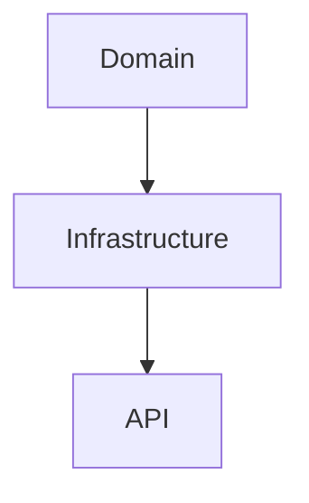

# Лекция 2. Знакомство с плаформой .NET. Фреймворк ASP.NET Core

В ходе этого занятия вы узнаете ответы на следующие вопросы:

1. Что такое ASP.NET приложения в современном мире?
2. Какая архитектура у приложения, построенного по принципу DDD?
3. Как приложение взаимодействует с внешним миром?
4. Как приложение взаимодействует с Базой Данных?
5. Как приложение тестировать с помощью внешних инструментов?


## Что такое ASP.NET приложения в современном мире

В современном мире .NET (версии 6 и выше), монополистом при построении 
веб приложений является ASP.NET Core. Данный фреймворк обладает
отличной расширяемостью, использует движок *Kestrel*, который
регулярно получает улучшения производительности.

Также стоит отметить и тот факт, что платформа .NET не стоит на месте
и регулярно улучшает как внутреннюю, так и внешнюю части. Так, например,
нововведением для .NET 6 стал Minimal API:

```csharp
var builder = WebApplication.CreateBuilder(args);
var app = builder.Build();

app.MapGet("/", () => "Hello world!");

app.Run();
```

И этот кусок кода является полноценным приложением!

В .NET 7 команда ASP.NET пошла дальше и решила улучшить работу с роутингом следующим образом: созданием групп.
И вместо следующего кода в .NET 6:
```csharp
app.MapGet("/api/users", () => { ... });
app.MapGet("/api/users/{id:long}", (long id) => { ... });
app.MapPost("/api/users", (User user) => { ... });
app.MapPut("/api/users/{id:long}", (long id, User user) => { ... });
app.MapDelete("/api/users/{id:long}", (long id) => { ... });
```
можно написать вот так:
```csharp
var userGroup = app.MapGroup("/api/users");

userGroup.MapGet("/", () => { ... });
userGroup.MapGet("/{id:long}", (long id) => { ... });
userGroup.MapPost("/", (User user) => { ... });
userGroup.MapPut("/{id:long}", (long id, User user) => { ... });
userGroup.MapDelete("/{id:long}", (long id) => { ... });
```
Код роутинга короче и позволяет понять к какой группе относятся роутинги.

## Какая архитектура у приложения, построенного по принципу DDD?

В современных приложениях, построенных по принципам DDD применяется следующая архитектура:



Рассмотрим детально каждый слой и что он должен содержать:

*Domain* - данный слой содержит в себе доменные сущности, с которыми оперирует сервис, а также контракты взаимодействия (интерфейсы).

*Infrastructure* - данный слой содержит в себе бизнес-логику приложения: то, как приложение оперирует сущностями, которые являются доменными.

*API* - данный слой содержит в себе взаимодействие с внешним миром: общение через HTTP, обработчики внешнего трафика итд.

## Как приложение взаимодействует с внешним миром?

Для того, чтобы взаимодействовать с внешним миром, приложение должно общаться по каким либо протоколам.
Так, например, можно общаться по протоколу HTTP, на котором строится весь Интернет.

### Типы запросов HTTP

При работе с протоколом HTTP выделяют несколько основных типов запросов, с которыми разработчики
проводят регулярное взаимодействие:

- GET - данный метод предназначен для получения информации. Если идентификатор или условие поиска не передается - 
считается, что необходимо вернуть все данные. Примечание: ответ от сервера может кэшироваться.
Тела (Method Body) данный метод не содержит.
- POST - данный метод предназначен для добавления информации на сервер. Позволяет передавать данные в теле запроса (Method Body).
- PUT - данный метод предназначен для обновления информации. Также возможен следующий кейс для данного типа запроса: если данных нет, он их добавляет. 
Стандартно передается идентификатор обновляемой записи и тело с данными к обновлению.
- DELETE - данный метод предназначен для удаления данных с сервера. Стандартно передается идентификатор удаляемой записи.

Каждый из этих методов обрабатывается с помощью методов, предоставляемых ASP.NET Core Minimal API:
```csharp
app.MapGet("/api/users", () => { ... });
app.MapGet("/api/users/{id:long}", (long id) => { ... });
app.MapPost("/api/users", (User user) => { ... });
app.MapPut("/api/users/{id:long}", (long id, User user) => { ... });
app.MapDelete("/api/users/{id:long}", (long id) => { ... });
```

## Как приложение взаимодействует с Базой Данных?

Для взаимодействия с Базой Данных в мире .NET зачастую применяются ORM.
Одной из частоиспользуемых ORM является EntityFramework Core (EF Core).
Данная библиотека позволяет легко и просто работать с Базой Данных, при этом
не взаимодействуя с ней напрямую. Вся работа с Базой Данных преобразуется в SQL под капотом,
позволяя разработчику не беспокоиться о том, как производить те или иные работы с БД.

### Термины и понятия

Говоря о EF Core стоит остановиться на 2 фундаментальных понятиях: Контекст (DbContext) и Множество (DbSet).
- DbContext - это элемент, включающий в себя набор из Множеств (DbSet), которые взаимодействуют с таблицами БД через сущности в виде классов языка C#.
- DbSet - это элемент, который позволяет выполнять работу с той или иной таблицей Базы Данных.

Чтобы подробнее рассмотреть примеры работы с БД, посмотрим на следующий листинг:
```csharp
public class UserContext : DbContext
{
    public DbSet<User> Users => Set<User>();
    
    ...
}
```

Здесь мы видим класс `UserContext`, который включает в себя свойство `Users`. Это и есть наши контекст и множество.

Но что с ними можно делать? Например, можно запросить всех пользователей:
```csharp
var context = new UserContext();
var users = context.Users.ToList();
```
Или, например, запросить только пользователей, которые старше 18 и моложе 26:
```csharp
var context = new UserContext();
var adultUsers = context.Users.Where(user => 18 <= user.Age && user.Age <= 26).ToList();
```
Все эти запросы будут корректно сконвертированы в SQL и позволят получить данные из Базы Данных.

## Как приложение тестировать с помощью внешних инструментов?

Один из инструментов для тестирования приложений, написанных на ASP.NET Core - это Swagger.
Данный инструмент помогает получить консоль разработчика, который может самостоятельно выполнить 
необходимые запросы к API с помощью UI.

Чтобы подключить Swagger в свой проект, необходимо выполнить следующие шаги:

1. Перейти в файл с расширением *.csproj в своем проекте ASP.NET Core
2. Найти элемент `<ItemGroup>...</ItemGroup>`, который содержит в себе ссылки на пакеты: `<PackageReference ... />`
3. Добавить следующие строки в данную группу, чтобы получилось вот так
    ```diff
    +<PackageReference Include="Microsoft.AspNetCore.OpenApi" Version="7.0.5" />
    +<PackageReference Include="Swashbuckle.AspNetCore" Version="6.4.0" />
    ```
4. После сохранения вашего проекта, IDE обновит зависимости и вы сможете получить доступ к Swagger.
5. После этого, в файле `Program.cs` рекомендуется добавить следующие строки
    ```diff
    var builder = WebApplication.CreateBuilder(args);
   
    +builder.Services.AddEndpointsApiExplorer();
    +builder.Services.AddSwaggerGen();
   
    var app = builder.Build();
   
    +if (app.Environment.IsDevelopment())
    +{    
    +    app.UseSwagger();
    +    app.UseSwaggerUI();
    +}
   
    app.Run();
    ```