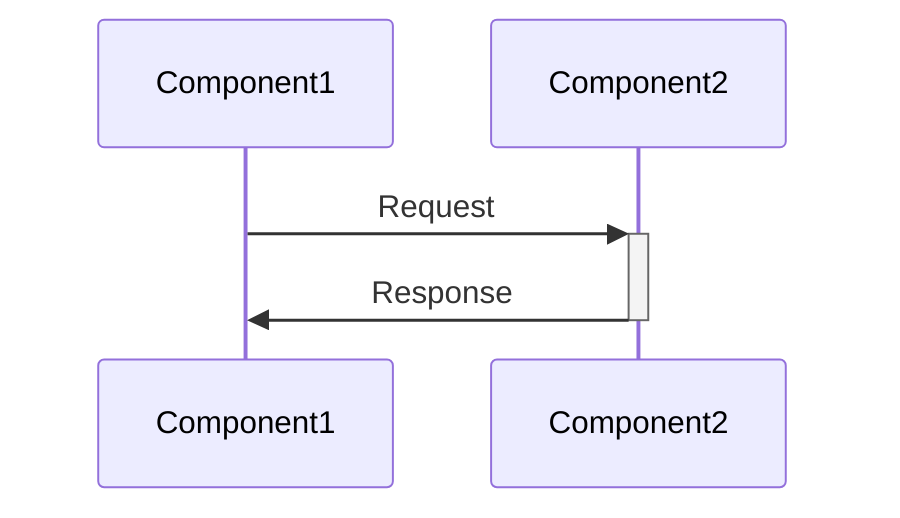
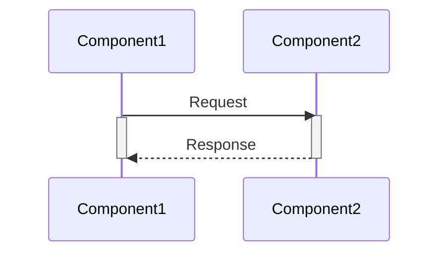

# Межсервисное взаимодействие: синхронное и асинхронное. Знакомство с gRPC и Apache Kafka.

В ходе этого занятия вы узнаете ответы на следующие вопросы:

1. Какие способы межсервисного взаимодействия имеются?
2. Что такое асинхронное взаимодействие?
3. Какие инструменты используются в ходе данного курса?
4. Примеры асинхронного взаимодействия
5. Что такое синхронное взаимодействие?
6. Какие инструменты используются в ходе данного курса?
7. Примеры синхронного взаимодействия

## Какие способы межсервисного взаимодействия имеются?

При разработке распределенной системы может использоваться 2 основных вида взаимодействия: синхронное и асинхронное.
Каждое из этих видов взаимодействий имеет как преимущества, так и недостатки, о которых мы поговорим ниже

## Что такое синхронное взаимодействие?

Синхронное взаимодействие - это процесс, при котором каждая часть системы работает
ожидая получения ответа от другой части системы



Преимуществами данного подхода к взаимодействию является простота и предсказуемость: если ответ получен, то мы знаем когда.

Недостатками является обратная ситуация: если другой компонент не отвечает, сервис может заблокировать клиентскую сторону и перестать реагировать
даже несмотря на свою доступность

## Какие инструменты используются в ходе данного курса?

В ходе этого курса будет использоваться один из популярных способов синхронного взаимодействия при проектировании 
микросервисной архитектуры - это gRPC. Данный инструмент был придуман в Google как для ускорения взаимодействия между сервисами,
так и для оптимизации сетевого трафика. Данный инструмент использует протокол ProtoBuf и файлы с расширением .proto, в которых хранится
описание контракта взаимодействия
```protobuf
syntax = "proto3";
 
option csharp_namespace = "GreeterServiceApp";
 
package greet;
 
// определение сервиса
service Greeter {
  // отправка сообщения
  rpc SayHello (HelloRequest) returns (HelloReply);
}
 
// сообщение от клиента содержит name
message HelloRequest {
  string name = 1;
}
 
// сообщение клиенту содержит message
message HelloReply {
  string message = 1;
}
```

## Примеры синхронного взаимодействия

В случае с gRPC можно отослать на статью, где рассматривается пример с построением сервиса на .NET: https://metanit.com/sharp/grpc/1.1.php

## Что такое асинхронное взаимодействие?

Асинхронное взаимодействие - это процесс, при котором каждая часть системы работает
не заблокировавшись на ожидание ответа от другой части системы



Преимуществами данного подхода к взаимодействию является отказоустойчивость и масштабируемость: 
сервис не блокируется в момент обращения и может успешно обрабатывать поступающие запросы.

За повышенную пропускную способность и возможность параллельно обрабатывать входящие запросы приходится платить усложнением как
реализации, так и отладки приложения. Поскольку запросы могут быть выполнены не сразу, а быть отложены, это затрудняет отслеживание ошибок.

## Какие инструменты используются в ходе данного курса?

В рамках данного курса будет использоваться инструмент под названием Apache.Kafka. 

Данный инструмент является брокером сообщений, который работает по Pull модели: сообщения не прилетают сразу, они ждут когда их прочтут.
У данного подхода есть плюс в виде возможности группировать входящие сообщения, но есть и минус в виде отсутствия мгновенной доставки.

## Примеры асинхронного взаимодействия

Пример асинхронного взаимодействия приведен в рамках данного репозитория в сервисе уведомлений: 
в проекте Host был показан Producer - тот, кто отправляет сообщения
в проекте Worker был показан Consumer - тот, кто получает сообщения